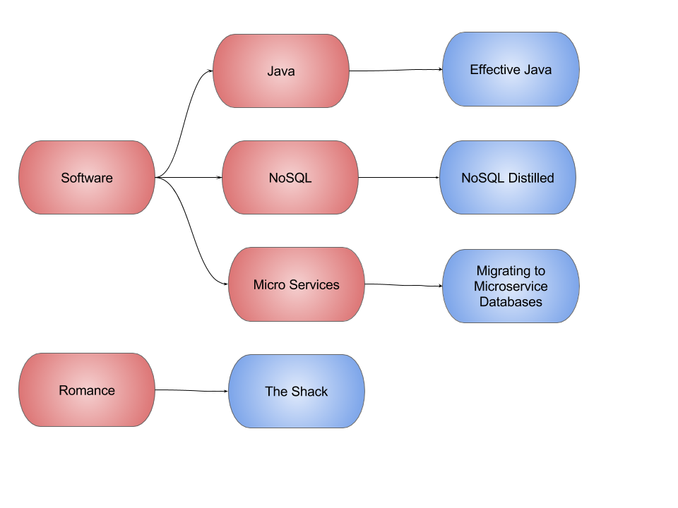
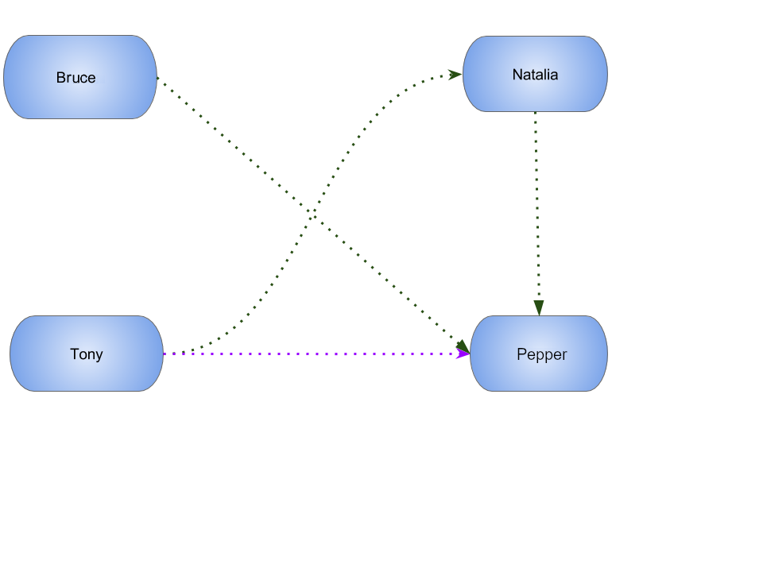
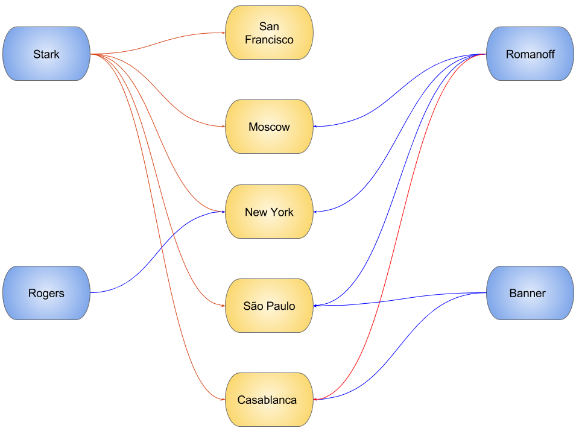

# Graph-JanusGraph

A JNoSQL Artemis project with Java SE using using Graph API with Janus.

JanusGraph is a scalable graph database optimized for storing and querying graphs containing hundreds of billions of vertices and edges distributed across a multi-machine cluster. JanusGraph is a transactional database that can support thousands of concurrent users executing complex graph traversals in real time.

## Run the code

### BookApp

Library recommendation, category based that shows the software categories, the software books and also a book those is
 Software and Java.

### HR Solution

The HR solution that allows to match some rules based on the relationship between four people.

### TravelApp

Given cities and travelers, this TravelApp will return the most famous city, the person who most travel and also some
 friends suggestion placed by the visited cities.

### TheGodsApp

The graph of Gods JanusGraph based

