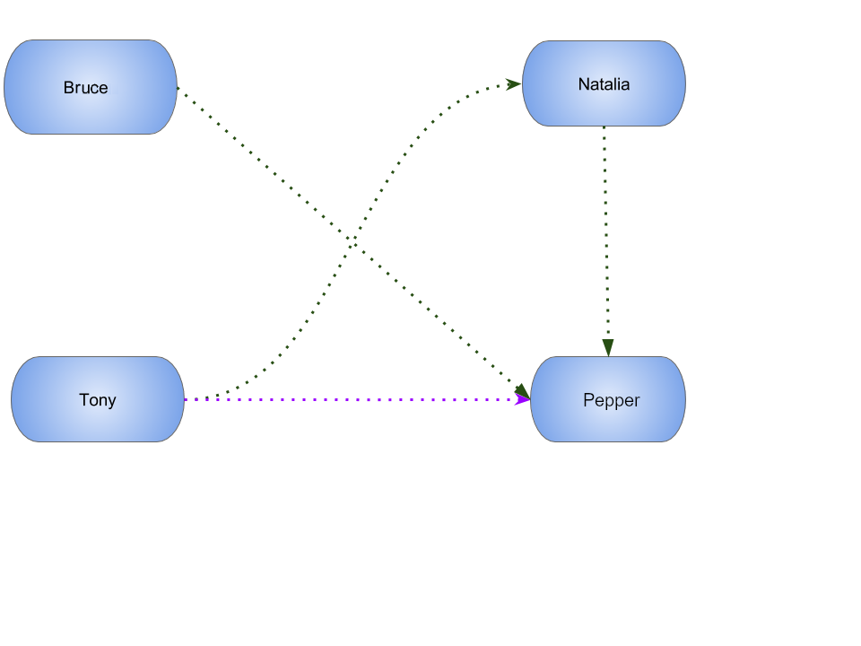

# Graph-Neo4J

A JNoSQL Artemis project with Java SE using using Graph API with Neo4J.

Neo4j is a graph database management system developed by  Neo4j, Inc. Described by its developers as an ACID-compliant transactional database with native graph storage and processing, Neo4j is the most popular graph database according to db-engines.com. Neo4j is available in a GPL3-licensed open-source "community edition", with online backup and high availability extensions licensed under the terms of the Affero General Public License. Neo also licenses Neo4j with these extensions under closed-source commercial terms. Neo4j is implemented in Java and accessible from software written in other languages using the Cypher Query Language through a transactional HTTP endpoint, or through the binary 'bolt' protocol.

To run this project a Neo4j instance is required, so you can use either a local installation or use Docker.

## Manual installation

Follow the instructions in: https://neo4j.com/docs/operations-manual/current/installation/

## Check the configuration

Check the configuration in GraphProducer.

This class has three attributes:

* `private static final String URL = "bolt://localhost:7687";`
* `private static final String USER = "neo4j";`
* `private static final String PASSWORD = "secret";`

## Run the code

### HR Solution

The HR solution that allows to match some rules based on the relationship between four people.

### TravelApp

Given cities and travelers, this TravelApp will return the most famous city, the person who most travel and also some
 friends suggestion placed by the visited cities.

### Gods of Asgard

This application shows the powers and relationships between gods of [Asgard](https://en.wikipedia.org/wiki/Asgard).

